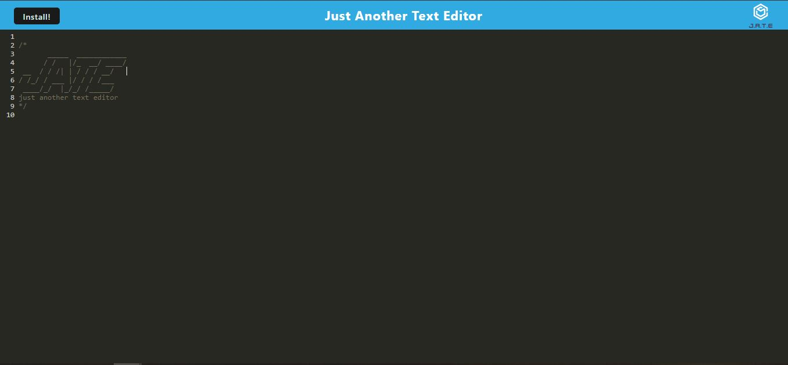
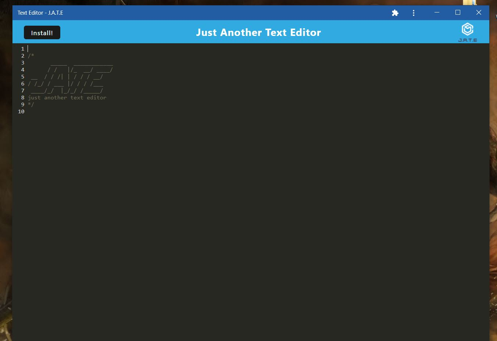

# Text Editor Starter Code

## Description

This repository is a PWA Text Editor for developers who would like to create notes or code snippets whether or not they have a reliable internet connection so that they can access them later.

## Link to deployed application

[Text Editor](https://guarded-ridge-10827.herokuapp.com/)

## Screenshots

## Change Log

### 2022-09-23
* Updated README
* Created images folder
* Added dist folder to .gitignore
* Fixed scripts in package.json
* Created .gitignore for server folder
* Required missing StaleWhileRevalidate for src-sw.js
* Added information for manifest
* Fixed split error within editor.js
* Added logic for installing PWA
* Created logic for database PUT and GET
* Built asset caching function registerRoute
* Built config for webpack
* Created scripts
* Removed Develop folder